SHIM Performance Measurement Plugin
================

本ツールは、SHIMのメモリアクセス性能や命令サイクル数といった
性能情報を測定し、設定する機能を持つ Eclipse Plug-in です。

  1. [Description](#description)
  * [Requirement](#requirement)
  * [Setup](#setup)
    - 3.1. [Install](#install)
    - 3.2. [Uninstall](#uninstall)
  * [Tutorial](#tutorial)
    - 4.1. [Procedures](#procedures)
    - 4.2. [Import the sample project](#import-the-sample-project)
    - 4.3. [Run the measurement process](#run-the-measurement-process)
  * [Configurations Dialog](#configurations-dialog)
    - 5.1. [Create the launch configuration](#create-the-launch-configuration)
      - 5.1.1. [Creation flow](#creation-flow)
      - 5.1.2. [Common Settings](#common-settings)
      - 5.1.3. [Main Tab](#main-tab)
      - 5.1.4. [MemoryPerformance Tab](#memoryperformance-tab)
      - 5.1.5. [InstructionCycle Tab](#instructioncycle-tab)
    - 5.2. [Launching the created configuration file](#launching-the-created-configuration-file)
  * [Sample Project Details](#sample-project-details)
    - 6.1. [About the sample project](#about-the-sample-project)
    - 6.2. [Directory structure(IA-32)](#directory-structure-ia32)
    - 6.3. [Directory structure(Generic)](#directory-structure-generic)
  * [Copyright](#copyright)
  * [License](#license)

1. <a name="description">Description</a>
----------------

本ツールでは、入力されたSHIMデータファイルに対し、以下の操作を行います。

  1. MasterComponent(PU)とメモリの組合せ毎にメモリアクセス性能(サイクル数)を
     計測するためのC言語ソースコード生成機能
  2. 1.のC言語コードで計測したサイクル数をSHIMへ書き込む機能
  3. 中間命令(Instruction)毎に命令サイクル数を計測するための
     C言語ソースコード生成機能
  4. 3.のC言語コードで計測した命令サイクル数をSHIMへ書き込む機能


ツールではInstructnionCycleやMemoryAccessの性能を
計測するためのC言語ソースコードを生成します。  
C言語ソースコードを生成するために必要な、アーキテクチャや実行環境
固有の設定は個別の設定ファイルに記載されます。  
設定ファイルはユーザがツール実行前に予め作成しておく必要があります。  

C言語ソースコードを使った測定の実行処理はツールでは行いません。  
測定処理を実行し、計測結果を出力するためには、
予め測定用スクリプトを作成しておく必要があります。  

計測結果はCSV形式のファイルからSHIMデータファイルへと取り込まれます。  


2. <a name="requirement">Requirement</a>
----------------
本ツールを利用するためには、以下が正しく設定されている必要があります。

  - Java SE Development Kit(JDK)
    * JDK 7 以降のバージョン
    * http://www.oracle.com/technetwork/java/javase/downloads/index.html

インストール後、環境変数に'JAVA_HOME'を追加し、JDKのインストール先のパスを設定してください。
また、JDKのインストール先の下にあるbinフォルダのパスを環境変数の'PATH'に追加してください。

  - Eclipse
    * 3.6(Helios) 以降のバージョン
    * https://eclipse.org/downloads/

Windowsの環境でサンプルを利用する場合、下記の何れかがインストールされ、
GCCなどの GNU Toolchain が利用可能となっている必要があります。
インストール後、Windows環境変数の’PATH’に、インストールフォルダの下にある
binフォルダのパスを追加してください。

  - MinGW
    * http://www.mingw.org/
  - Cygwin
    * https://www.cygwin.com/

3. <a name="setup">Setup</a>
----------------

### 3.1. <a name="install">Install</a>
インストールは以下の手順で実施して下さい。

  1. 最新版のプラグイン.jarファイルをダウンロード
  *  Eclipseのpluginディレクトリ(dropins)以下の任意のディレクトリに.jarファイルを格納
  *  Eclipseを再起動

Eclipse再起動後、ツールバーの領域に下記のようなアイコンが表示されます。  

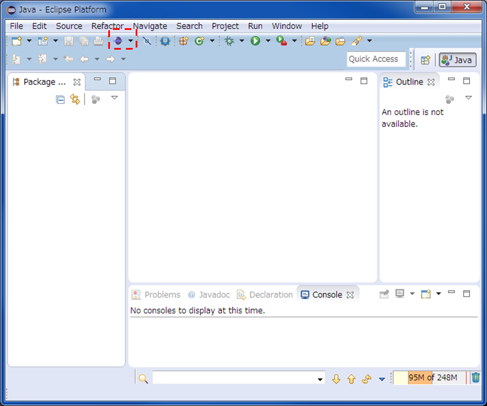  
**figure1. IDE after installation**

また "Help->About Eclipse Platform->Installation Details->Plug-ins" に
インストールしたプラグインの情報が追加されているか確認して下さい。  

  
**figure2. Plug-ins Installation Details(1)**

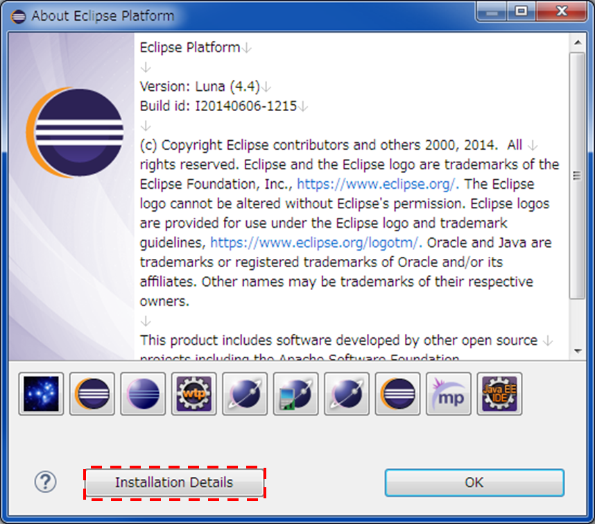  
**figure3. Plug-ins Installation Details(2)**

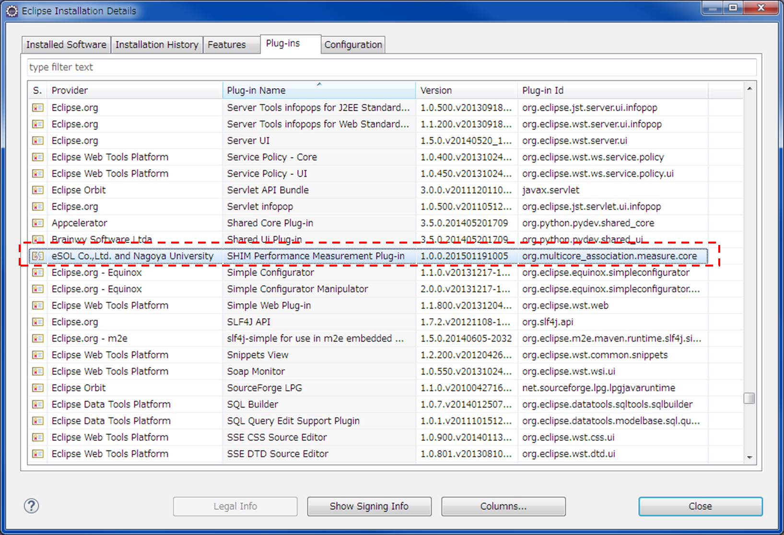  
**figure2. Plug-ins Installation Details(3)**

### 3.2. <a name="uninstall">Uninstall</a>
アンインストールするには、Install時に格納した.jarファイルを削除して下さい。


4. <a name="tutorial">Tutorial</a>
----------------
#### 4.1. <a name="procedures">Procedures</a>
本セクションではSHIM Performance Measurement Plug-in の利用方法について解説します。  
サンプルプロジェクトを利用し、Windows環境上で性能計測を行ってみましょう。  
ここでは、2種類あるサンプルプロジェクトのうち、IA32向けサンプルプロジェクト(sample_IA32)を利用します。  
サンプルプロジェクトの利用手順は以下の通りです。  

  1. サンプルプロジェクトを Import する
  *  計測方法や集計方法などを変更したい場合など、  
     必要に応じて各種ファイルを書き換える
  *  サンプルプロジェクトを選択し、ツールバー上のドロップダウンから  
     InstructionCycle または MemoryPerformance の計測機能を実行する
  *  出力結果を確認する
    - 計測結果を反映したSHIMファイルはデフォルトで data/ 直下に配置されます。
    - 計測の途中経過である生成コードやCSVファイルは Measurement/ に出力されます。
  * 必要に応じて 2. ～ 4. の手順を繰り返す

サンプルプロジェクトは、SHIM Performance Measurement Plugin を  
インストールした Eclipse 環境に Import することで使用可能となります。  
サンプルプロジェクトの詳細については 6.
[Sample Project Details](#sample-project-details)
に記載しています。

#### 4.2. <a name="import-the-sample-project">Import the sample project</a>
サンプルプロジェクトのインポート手順は以下の通りです。

1. Eclipse の 'File' メニュー から 'Import' を選択する
*  'import source' のリストから 'General/Existing Projects into Workspace' を選択する
*  'Select root directry'(または'Select archive file') の 'Browse' から sample_IA32 の  
    プロジェクトを含むディレクトリ(またはアーカイブ) を選択する
*  'Project'：欄で 'sample_IA32/'' にチェックが入っていることを確認し 'Finish' ボタンを押下する

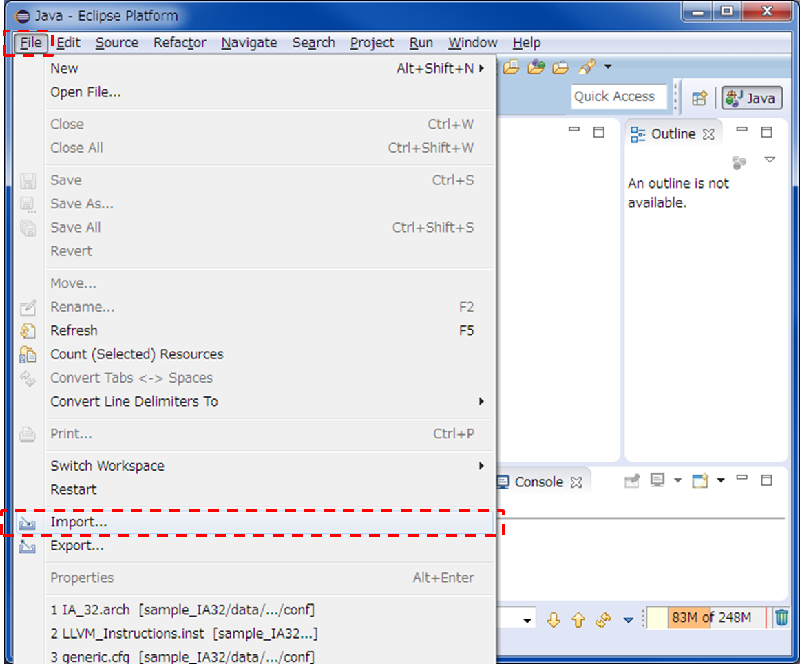  
**figure5. Sample Project import procedure(1)**

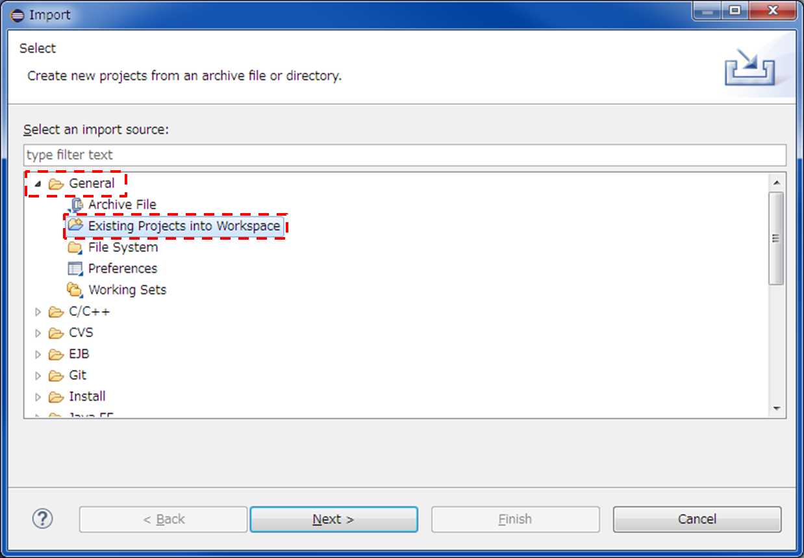  
**figure6. Sample Project import procedure(2)**

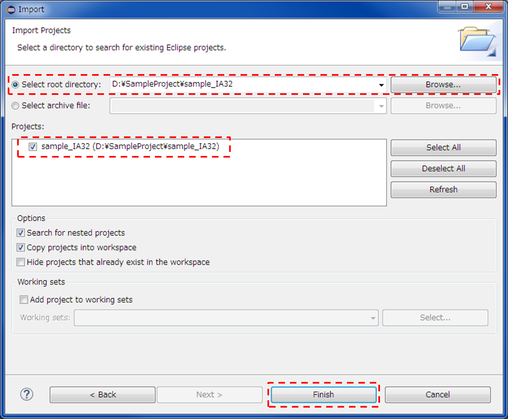  
**figure7. Sample Project import procedure(3)**

#### 4.3. <a name="run-the-measurement-process">Run the measurement process</a>
サンプルプロジェクトのインポート後、そのまま計測処理が実行可能です。  
計測処理は以下の2種類が実行可能です。  

  - Instruction Cycle
  - Memory Access Performance

これら2種類の計測処理を同時に実行することは出来ません。  

計測を実行の手順は以下のとおりです。

  1. 計測実行対象となるサンプルプロジェクトを選択する
  *  ツールバー上のアイコンのドロップダウンを開く
  *  実行したい機能の実行構成を選択する
    - メモリアクセス性能計測の場合:  
      [Memory Performance Measurement...]>[sample_IA32_MemoryPerform]
    - 命令サイクル数計測の場合:  
      [Instruction Cycle Extraction...]>[sample_IA32_InstructionCycle]

Tips: ツールバー上のアイコンをクリックするか、ドロップダウンの最上部の
      メニューを選択すると、直前に実行した実行構成を起動出来ます。

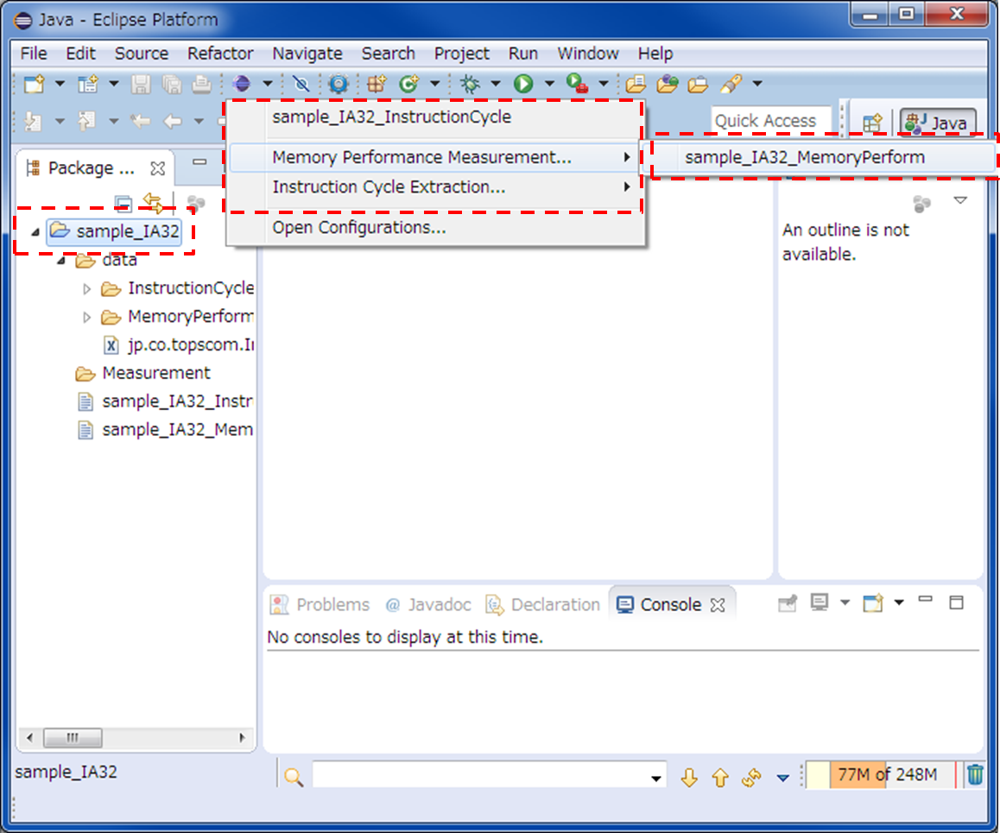  
**figure8. Execution method of Sample Project**

計測処理を実行すると、同梱のサンプルSHIMファイル
(jp.co.topscom.Intel_i5_3550.win7_sp1_64.LLVM3_4_CycCoarseMeasure.xml)から
情報を読み出し、計測用のC言語ソースコードを生成します。
この時、生成されたソースコードは Measurement ディレクトリ以下に
一時ディレクトリが生成され、そこに保存されます。

その後、サンプルに同梱されているシェルスクリプトを利用して
一時ディレクトリ上で計測用のプログラムがビルドされ、計測処理が行われます。

計測結果は一時ディレクトリにCSVファイルとして出力され、
そのファイルを使ってSHIMファイルへと書き戻されます。

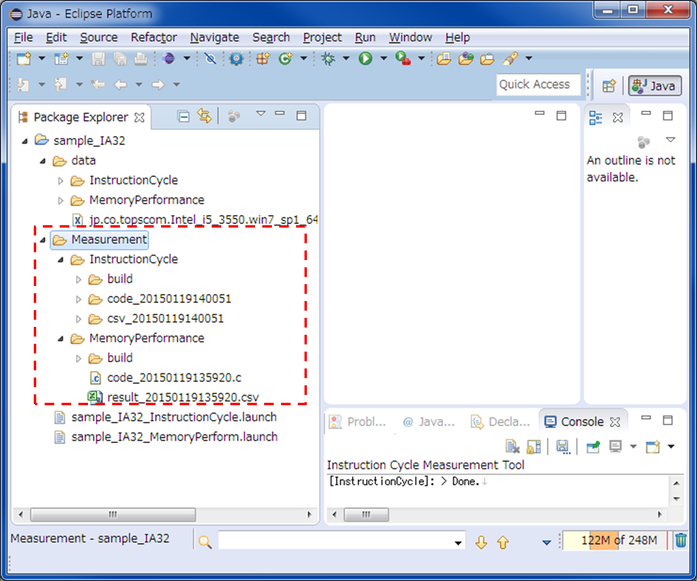  
**figure9. The contents of the temporary directory**

サンプルでは、CSVファイルの内容が書き戻されたSHIMファイルを
プロジェクトのdataディレクトリ以下に以下の名前で出力します。

  - メモリアクセス性能計測後のSHIMファイル  
    memory_perform_out_shim.xml
  - 命令サイクル数計測後のSHIMファイル  
    instruction_cycle_out_shim.xml

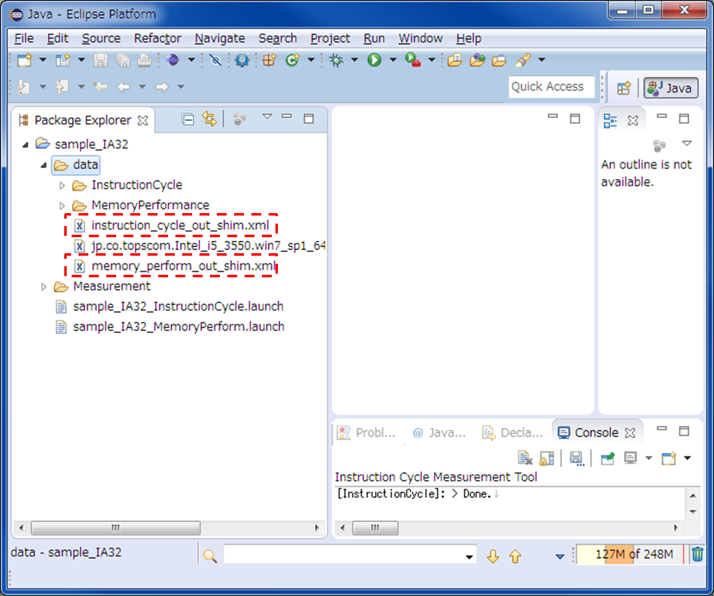  
**figure10. The SHIM file which reflected measuring result**

5. <a name="configurations-dialog">Configurations Dialog</a>
----------------

### 5.1. <a name="create-the-launch-configuration">Create the launch configuration</a>
#### 5.1.1 <a name="creation-flow">Creation flow</a>

ツールを実行するためには、予め実行構成ファイル(.launch)を作成する必要があります。
実行構成ファイルには、実行する機能の種別や、SHIMファイルのパスといった情報が設定されます。  

実行構成ファイルの作成は次の手順で行います。

  1. 実行構成の編集対象となるサンプルプロジェクトを選択する(figure11)
  * ツールバーのアイコンのドロップダウンを開き、
    "Open Configurations..." メニューを選択する
  * 実行構成設定画面の "SHIM Performance Measurement" を選択し、
    新規作成ボタンを押下する (figure12)
  * ツールの実行に必要な設定を編集し、エラーが出ていないことを確認する
  * "Apply"ボタンを押下し、編集内容を確定する

また、プロジェクト内に実行構成ファイルが存在しない場合、
ツールバーアイコンのドロップダウンから選択できる'Memory Performance Measurement...'と
'Instruction Cycle Extraction...'から実行構成ファイルの新規作成メニューが選択出来ます。 (figure13)

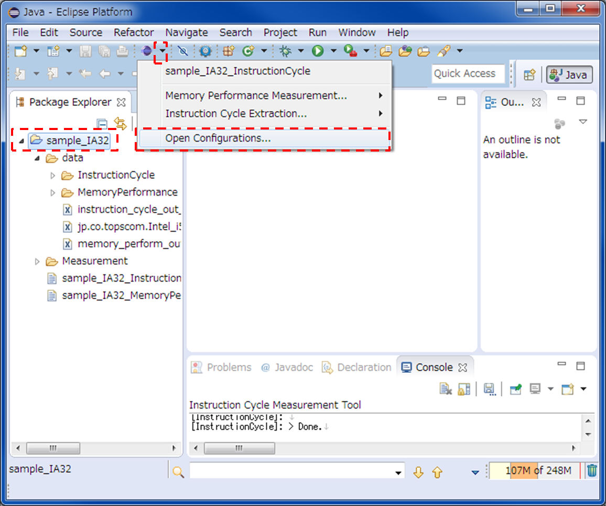  
**figure11. Open Configurations Menu**

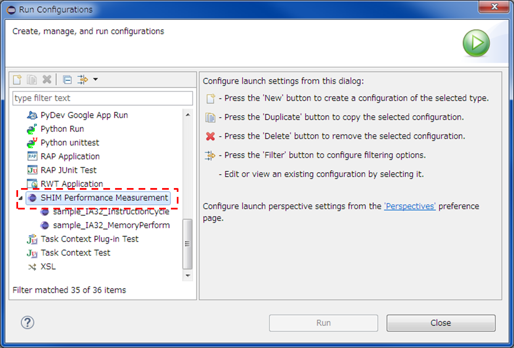  
**figure12. Run Configuration Dialog**

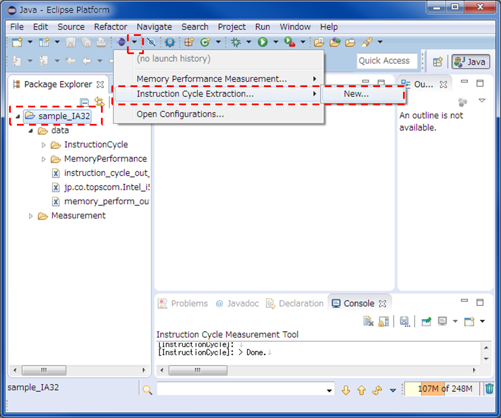  
**figure13. New Configurations Menu**

#### 5.1.2. <a name="common-settings">Common Settings</a>

設定編集画面の各タブに共通して以下の設定が可能です。

##### Name
実行構成ファイルの名前を設定します。通常、
{プロジェクト名}_{選択された機能の種別} の形式で設定されます。

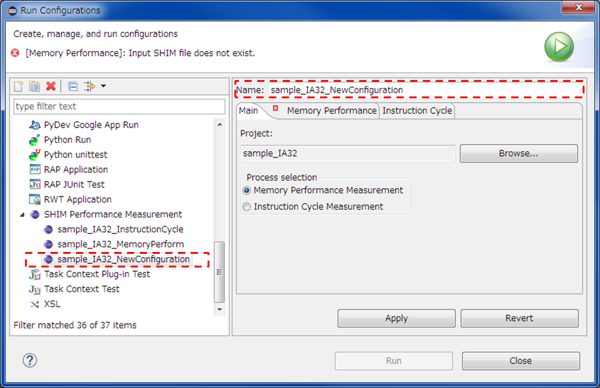  
**figure14. Selection of individual configuration settings**

#### 5.1.3. <a name="main-tab">Main Tab</a>

Main Tabで設定可能な項目は以下の通りです。

##### Project
設定保存先のプロジェクト名を指定します。指定されたプロジェクトに
".launch" ファイルや一時ディレクトリが生成されます。

##### Process selection
設定したい機能(Memory Performance Measurement
または Instruction Cycle Measurement)を選択します。

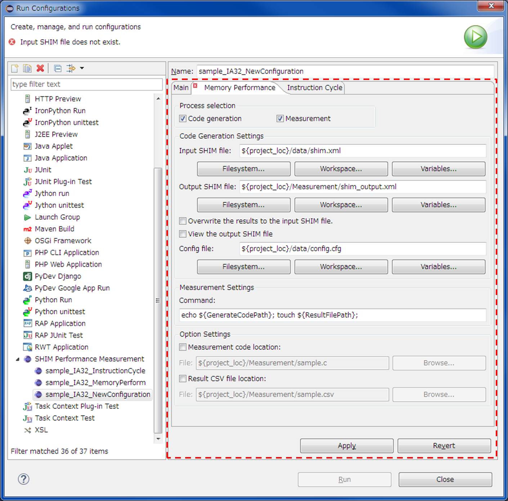  
**figure15. Main Tab**

#### 5.1.4. <a name="memoryperformance-tab">MemoryPerformance Tab</a>

MemoryPerformance Tabで設定可能な項目は以下の通りです。

##### Process selection
実行する機能を選択します。機能はコード生成(Code generation)
及び計測(Measurement)の2つがあります。

##### Input SHIM file
入力SHIMファイルを指定します。

##### Output SHIM file
出力SHIMファイルを指定します。

##### Overwrite the results to the input SHIM file
チェックした合、入力SHIMファイルに結果を上書きします。

##### View the output SHIM file
チェックした場合、処理完了後に結果のSHIMファイルをIDEに表示します。

##### Config file
入力する設定ファルを指定します。

##### Command
計測実行用のコマンドや、スクリプトを指定します。"${GenerateCodePath}" や
"${ResultFilePath}" と記載されていた場合、それぞれ生成コードのパスと
結果格納用CSVファイルのパスが設定されます。

##### Measurement code location
計測コードの出力先を指定します。設定されていない場合、
プロジェクト内の一時ディレクトリに出力されます。

##### Result CSV file location
計測結果CSVファイルを指定します。設定されていない場合、
プロジェクト内の一時ディレクトリに出力されます。

計測結果CSVファイルには1行毎に以下の順番でパラメータを記載します。

| 列番 |                 要素 | 説明 |
|------|----------------------|------|
|    1 | AddressSpace name    | 結果設定対象のAddressSpaceのname属性。 |
|    2 | SubSpace name        | 結果設定対象のSubSpaceのname属性。 |
|    3 | SlaveComponent name  | 結果設定対象のMasterSlaveBindingのslaveComponentRef要素から辿った、SlaveComponentのname属性。 |
|    4 | MasterComponent name | 結果設定対象のAccessorのmasterComponentRef属性から辿った、masterComponentのname属性。 |
|    5 | Access Type name     | 結果設定対象のPerformanceのaccessTypeRef属性から辿った、AddressSpaceのname属性。 |
|    6 | Latency (best)       | 設定するLatencyのbest値。 |
|    7 | Latency (worst)      | 設定するLatencyのworst値。 |
|    8 | Latency (typical)    | 設定するLatencyのtypical値。 |
|    9 | Pitch (best)         | 設定するPitchのbest値。 |
|   10 | Pitch (worst)        | 設定するPitchのworst値。 |
|   11 | Pitch (typical)      | 設定するPitchのtypical値。 |


列番1～5の項目は、要素を正確に特定するため、SystemConfigurationから辿った経路のname属性を並べ、
'\_\_'(アンダースコア2つ)で区切って表記する形式で記載する必要があります。

例: SubSpace name の設定値が ’AS_exclusive_support_global_address_area__SS_CRAM_Bank0_C0’ の場合

上記の例では、'\_\_' で区切ると次のように分割出来ます。

  - AS_exclusive_support_global_address_area
  - SS_CRAM_Bank0_C0

この例で示されるSubSpaceを検索する場合は、まずSystemConfiguration要素から辿れる、
'AS_exclusive_support_global_address_area' というname属性を持つAddressSpace要素を探索します。
そして、そのAddressSpace要素から辿れる、'SS_CRAM_Bank0_C0' というname属性を持つSubSpace要素を探索します。

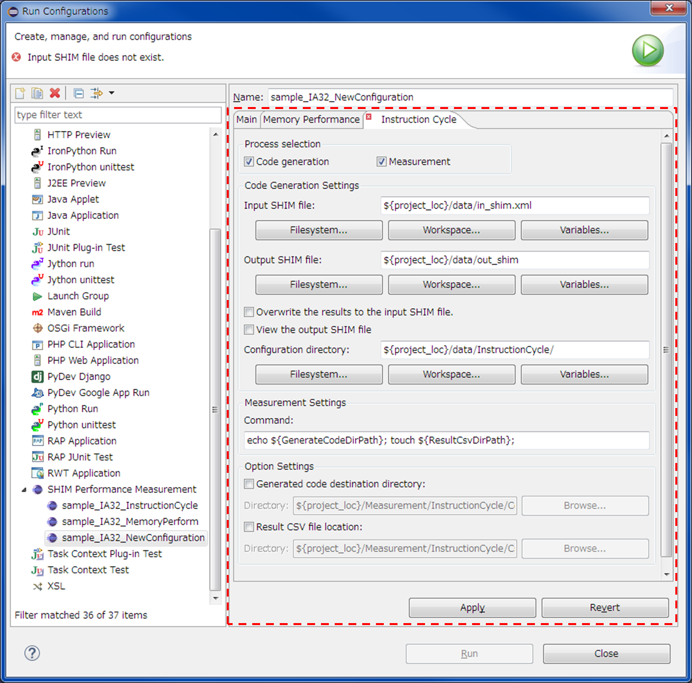  
**figure16. MemoryPerformance Tab**

#### 5.1.5. <a name="instructioncycle-tab">InstructionCycle Tab</a>

InstructionCycle Tabで設定可能な項目は以下の通りです。

##### Process selection  
実行する機能を選択します。
機能はコード生成(Code generation)および計測(Measurement)の2つがあります。

##### Input SHIM file
入力SHIMファイルを指定します。

##### Output SHIM file
出力SHIMファイルを指定します。

##### Overwrite the results to the input SHIM file
チェックされた場合、入力SHIMファイルに結果を上書きします。

##### View the output SHIM file
チェックした場合、処理完了後に結果のSHIMファイルをIDEに表示します。

##### Configuration directory
設定ファイルが格納されたディレクトリを指定します。

このディレクトリには、アーキテクチャ別設定ファイル(.arch)、
及び共通命令セット別設定ファイル(.inst)が格納されます。

アーキテクチャ別設定ファイルのファイル名は、
SHIMファイルのMasterComponentのarch属性と一致している必要があります。

また、共通命令セット別設定ファイルのファイル名は、
SHIMファイルのCommonInstructionSetのname属性と一致している必要があります。  
この際、スペースやハイフンなどの特殊記号は全てアンダースコアに置き換える必要があります。

|置き換えが必要な記号|
|-------------------|
|\, /, :, &#8727;, ?, ", <, >, &#124;, -|


##### Command
計測実行用のコマンドや、スクリプトを指定します。"${GenerateCodeDirPath}" や
"${ResultCsvDirPath}" と記載されていた場合、それぞれ生成コードのパスと
結果格納用CSVファイルのパスが設定されます。

##### Generated code destination directory
計測コードの出力先を指定します。設定されていない場合、
プロジェクト内の一時ディレクトリに出力されます。

##### Result CSV file location
計測結果CSVファイルを指定します。設定されていない場合、
プロジェクト内の一時ディレクトリに出力されます。

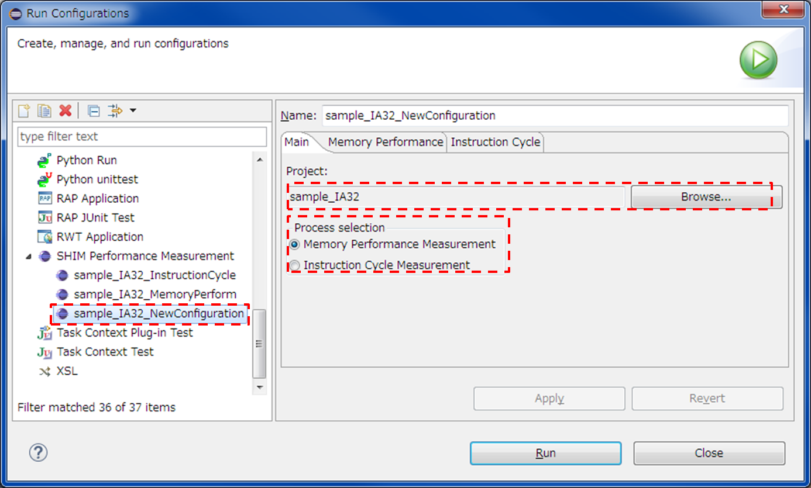  
**figure17. InstructionCycle Tab**

### 5.2. <a name="launching-the-created-configuration-file">Launching the created configuration file</a>

作成した実行構成を実行するには、起動対象のプロジェクトを選択した状態で
一度設定画面を開いてから "Run" ボタンを押します。  
または、起動対象のプロジェクトを選択した状態で、下図のようにツールバー上の
ドロップダウンメニューから実行構成を選択することでも実行可能です。  

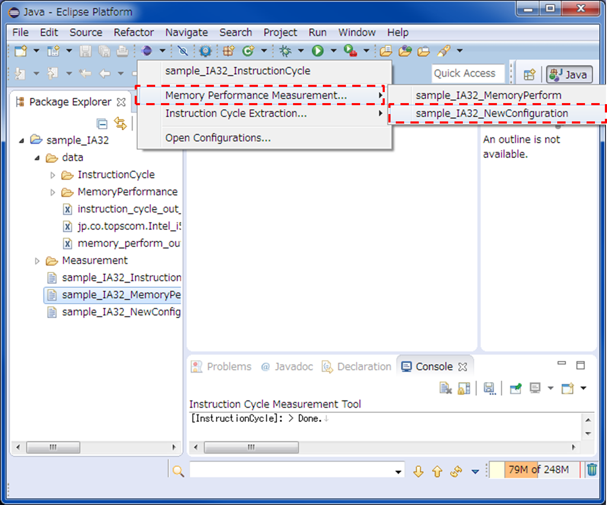  
**figure18. Selection of launch configuration**

6. <a name="sample-project-details">Sample Project Details</a>
----------------

### 6.1. <a name="about-the-sample-project">About the sample project</a>
本ツールを利用したサンプルプロジェクトとして下記の2種類を用意しています。

  - IA32向けサンプルプロジェクト(sample_IA32/, Windows環境用)
  - 汎用サンプルプロジェクト(sample_generic/)

IA32向けサンプルは MinGWまたはCygwinがインストール・PATH設定が行われ、
GNU Toolchainが使用可能な環境において実行可能です。

汎用サンプルプロジェクトはそのまま実行することは出来ません。
実行のためには、別途シミュレータや評価ボードを用意し、
それに合わせてソースコードを修正する必要があります。

ここでは、IA32向けWindowsOSを搭載した環境でサンプルプロジェクトを
使用する手順について解説します。  
サンプルプロジェクトはGNU Toolchain によるコンパイルを実施します。  
そのため、Windows上でGNU Toolchain が利用可能なMinGWなどの環境を
予め用意しておく必要があります。  


### 6.2. <a name="directory-structure-ia32">Directory structure(IA-32)</a>
サンプルプロジェクト(sample_IA32/)のディレクトリ構成は以下の通りです。

- **data/**  --------  計測に利用する各種データファイルを格納しています。
  - **InstructionCycle/**  --------  命令サイクル数計測用のデータを格納しています。
    - **code/**  --------  ビルド時に必要なソースコードを格納しています。
      + *sample_IA32_instruction_cycle.c*  --------  命令サイクル数計測用ソースコードです。
    - **conf/**  --------  コード生成プログラムに入力する設定ファイルを格納しています。
      + *IA_32.arch*  --------  アーキテクチャ別設定ファイル(IA_32用)
      + *LLVM_Instructions.inst*  --------  共通命令セット別設定ファイル(LLVM Instructions用)
    - **script/**  --------  生成コードのビルドや計測を実施するためのスクリプトを格納しています。
      + *Makefile*  --------  計測用プログラムをビルドするためのMakefileです。
      + *measurement.sh*  --------  計測処理の実行や結果の整形を行うスクリプトです。
  - **MemoryPerformance/**  --------  メモリアクセス性能計測用のデータを格納しています。
    - **code/**  --------  ビルド時に必要なソースコードを格納しています。
      + *measurement.h* -------- メモリアクセス性能計測処理のサンプルです。
      + *mem_access.c* -------- メモリアクセス性能計測処理のサンプルです。
      + *mem_access.h* -------- メモリアクセス性能計測処理のサンプルです。
      + *mem_asminc.h* -------- メモリアクセス性能計測処理のサンプルです。
      + *sample_IA32_memory_perform.c*  --------  メモリアクセス性能計測用ソースコードです。
    - **conf/**  --------  コード生成プログラムに入力する設定ファイルを格納しています。
      + *generic.cfg*  --------  メモリアクセス性能計測用の一般的な設定ファイルです。
    - **scrypt/**  --------  生成コードのビルドや計測を実施するためのスクリプトを格納しています。
      + *Makefile*  --------  計測用プログラムをビルドするためのMakefileです。
      + *measurement.sh*  --------  計測処理の実行や結果の整形を行うスクリプトです。
  + *jp.co.topscom.Intel_i5_3550.win7_sp1_64.LLVM3_4_CycCoarseMeasure.xml*  
    --------  サンプル実行用IA32環境向けSHIMファイルです。
- **Measurement/**  --------  ワークディレクトリです。(初期状態では中身は無し)
+ *sample_IA32_InstructionCycle.launch*  --------  命令サイクル数計測の実行構成ファイルです。
+ *sample_IA32_MemoryPerform.launch*  --------  メモリアクセス性能計測の実行構成ファイルです。


### 6.3. <a name="directory-structure-generic">Directory structure(Generic)</a>
サンプルプロジェクト(sample_generic/)のディレクトリ構成は以下の通りです。

- **data/**  --------  計測に利用する各種データファイルを格納しています。
  - **InstructionCycle/**  --------  命令サイクル数計測用のデータを格納しています。
    - **code/**  --------  ビルド時に必要なソースコードを格納しています。
      + *sample_generic_instruction_cycle.c*  --------  命令サイクル数計測用ソースコードです。
      + *generic.h* -------- 空のファイルです。
      + *simulator.h* -------- 空のファイルです。
      + *sreg.h* -------- 空のファイルです。
      + *boot.S* -------- 空のファイルです。
      + *util.S* -------- 空のファイルです。
    - **conf/**  --------  コード生成プログラムに入力する設定ファイルを格納しています。
      + *GenericRISC_CPU.arch*  --------  アーキテクチャ別設定ファイル(GenericRISC CPU用)
      + *LLVM_Instructions.inst*  --------  共通命令セット別設定ファイル(LLVM Instructions用)
    - **script/**  --------  生成コードのビルドや計測を実施するためのスクリプトを格納しています。
      + *dummy.csv* -------- CSVへの結果出力例のファイルです。
      + *gdb.sh* -------- GDB起動用シェルスクリプトのサンプルです。
      + *gdb-command.x* -------- GDBのコマンドファイルのサンプルです。
      + *Makefile*  --------  計測用プログラムをビルドするためのMakefileです。
      + *measurement.sh*  --------  計測処理の実行や結果の整形を行うスクリプトです。
      + *OpCode.txt* -------- 結果設定対象命令の一覧です。
      + *run-simurator.sh* -------- シミュレータ起動用スクリプトのサンプルです。
      + *sample.ld* -------- 空のリンカスクリプトファイルです。
      + *SimulatorCycleToCsv.py* -------- GDB等より抽出した計測結果データからCSVファイルを作成するスクリプトのサンプルです。
  - **MemoryPerformance/**  --------  メモリアクセス性能計測用のデータを格納しています。
    - **code/**  --------  ビルド時に必要なソースコードを格納しています。
      + *measurement.h* -------- メモリアクセス性能の計測処理のサンプルです。
      + *mem_access.c* -------- メモリアクセス性能計測処理のサンプルです。
      + *mem_access.h* -------- メモリアクセス性能計測処理のサンプルです。
      + *mem_asminc.h* -------- メモリアクセス性能計測処理のサンプルです。
      + *sample_GenericRISC_CPU_memory_perform.c*  --------  メモリアクセス性能計測用ソースコードです。
      + *simulator.h* -------- 空のファイルです。
      + *sreg.h* -------- 空のファイルです。
      + *boot.S* -------- 空のファイルです。
      + *util.S* -------- 空のファイルです。
    - **conf/**  --------  コード生成プログラムに入力する設定ファイルを格納しています。
      + *generic.cfg*  --------  メモリアクセス性能計測用の一般的な設定ファイルです。
    - **scrypt/**  --------  生成コードのビルドや計測を実施するためのスクリプトを格納しています。
      + *dummy.csv* -------- CSVへの結果出力例のファイルです。
      + *gdb.sh* -------- GDB起動用シェルスクリプトのサンプルです。
      + *gdb-command.x* -------- GDBのコマンドファイルのサンプルです。
      + *Makefile* -------- 計測用プログラムをビルドするためのMakefileです。
      + *measurement.sh* -------- 計測処理の実行や結果の整形を行うスクリプトです。
      + *run-simurator.sh* -------- シミュレータ起動用スクリプトのサンプルです。
      + *sample.ld* -------- 空のリンカスクリプトファイルです。
      + *SimulatorResultToCsv.py* -------- GDB等より抽出した計測結果データからCSVファイルを作成するスクリプトのサンプルです。
    + *sample.genericRISC_16core.0_0_0.unknown_Compliler.0_0_0.xml*  
--------  一般的な RISC CPU 16コアの環境について記述されたSHIMファイルのサンプルです。
- **Measurement/**  --------  ワークディレクトリです。(初期状態では中身は無し)
+ *sample_generic_InstructionCycle.launch*  --------  命令サイクル数計測の実行構成ファイルです。
+ *sample_generic_MemoryPerform.launch*  --------  メモリアクセス性能計測の実行構成ファイルです。

サンプルには一部、省略・改変されているものや、中身が空のファイルが存在します。
これらは、実行環境に合わせ、ツールのユーザ側で編集する必要があります。

7. <a name="copyright">Copyright</a>
----------------
Copyright (c) 2014 eSOL Co.,Ltd. and Nagoya University

This product includes software developed by
The Apache Software Foundation (http://www.apache.org/).

Apache Commons CLI:  
Copyright 2001-2009 The Apache Software Foundation

Apache Commons Collections:  
Copyright 2001-2008 The Apache Software Foundation

Apache Commons Lang:  
Copyright 2001-2011 The Apache Software Foundation

Apache Velocity:  
Copyright (C) 2000-2007 The Apache Software Foundation

This product includes software developed by Ivan SZKIBA
(http://ini4j.sourceforge.net/).

ini4j:  
Copyright 2005,2009 Ivan SZKIBA

8. <a name="license">License</a>
----------------
```
The MIT License (MIT)

Permission is hereby granted, free of charge, to any person obtaining a copy
of this software and associated documentation files (the "Software"), to deal
in the Software without restriction, including without limitation the rights
to use, copy, modify, merge, publish, distribute, sublicense, and/or sell
copies of the Software, and to permit persons to whom the Software is
furnished to do so, subject to the following conditions:

The above copyright notice and this permission notice shall be included in
all copies or substantial portions of the Software.

THE SOFTWARE IS PROVIDED "AS IS", WITHOUT WARRANTY OF ANY KIND, EXPRESS OR
IMPLIED, INCLUDING BUT NOT LIMITED TO THE WARRANTIES OF MERCHANTABILITY,
FITNESS FOR A PARTICULAR PURPOSE AND NONINFRINGEMENT. IN NO EVENT SHALL THE
AUTHORS OR COPYRIGHT HOLDERS BE LIABLE FOR ANY CLAIM, DAMAGES OR OTHER
LIABILITY, WHETHER IN AN ACTION OF CONTRACT, TORT OR OTHERWISE, ARISING FROM,
OUT OF OR IN CONNECTION WITH THE SOFTWARE OR THE USE OR OTHER DEALINGS IN
THE SOFTWARE.
```
